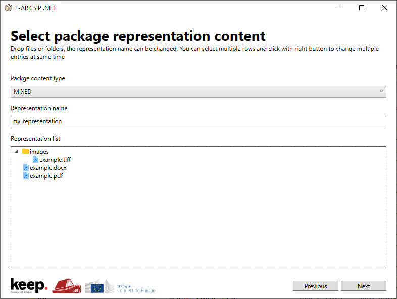

# E-ARK IP manipulation .NET library
.NET API to manipulate OAIS Information Packages of different formats: E-ARK, BagIt, Hungarian type 4 SIP.

The E-ARK Information Packages are maintained by the Digital Information LifeCycle Interoperability Standards Board (DILCIS Board). DILCIS Board is an international group of experts committed to maintain and sustain maintain a set of interoperability specifications which allow for the transfer, long-term preservation, and reuse of digital information regardless of the origin or type of the information.

More specifically, the DILCIS Board maintains specifications initially developed within the E-ARK Project (02.2014 - 01.2017):

* Common Specification for Information Packages
* E-ARK Submission Information Package (SIP)
* E-ARK Archival Information Package (AIP)
* E-ARK Dissemination Information Package (DIP)

The DILCIS Board collaborates closely with the Swiss Federal Archives in regard to the maintenance of the SIARD (Software Independent Archiving of Relational Databases) specification.

For more information about the E-ARK Information Packages specifications, please visit [http://www.dilcis.eu/](http://www.dilcis.eu/)

## Run demonstration example

### Requirements
To run the application you must comply with the following environment requirements:
* Microsoft Windows (7 or above)
* .NET Framework (4.7.2 or above)

Download `commons-ip-dotnet-demo.zip` from [latest release](https://github.com/keeps/commons-ip-dotnet/releases/latest). Right-click and select Extract here. Open folder and execute file `commons-ip-dotnet-demo.exe`.



The application allows you to create E-ARK SIP files from your own files. In order to create these packages, you'll have to perform the following tasks (as presented in the application): 
 * **Set package description:** set the package basic information (e.g. identification, description, creator info).
 * **Select descriptive metadata file:** select descriptive metadata file and select the  descriptive metadata file type. The application **does not perform any validations** regarding the selected file and metadata type. The metadata types are the ones available in the original commons-ip implementation (e.g. EAD, EAC-CPF).
 * **(Optional) select other metadata files:**  select other metadata files to add to the package (e.g. information about how files were created and stored, intellectual property rights).
 * **Select package representation content:** add all the package files and/or folders into one representation. You can drop files or folders containing files (folders with sub-folders will be discarded). You can also rename the representation name (default value is "Representation"). 
 * **Select destination file and create package:** create the EARK-SIP file by choosing where the file will be saved.

The project source code is available in the root `commons-ip-dotnet` folder.

## Use as a library

### Requirements
To use this project, you must comply with the following environment requirements:
* Microsoft Windows (7 or above)
* Visual Studio (2015 or above)
* .NET Framework (4.7.2 or above)

### Dependencies
In this section it's specified 3rd party libraries necessary to use this package.

* **NuGet manager:** 
NuGet is the package manager for .NET. The NuGet client tools provide the ability to produce and consume packages. The NuGet Gallery is the central package repository used by all package authors and consumers.
Read more information at [https://www.nuget.org/](https://www.nuget.org/). 
Download the package at [https://www.nuget.org/downloads](https://www.nuget.org/downloads)

* **IKVM:** IKVM.NET is an implementation of Java for Mono and the Microsoft .NET Framework. It includes the following components.
    * A Java Virtual Machine implemented in .NET
    * A .NET implementation of the Java class libraries
    * Tools that enable Java and .NET interoperability

    For more information see [http://www.ikvm.net/](http://www.ikvm.net/).
    
    IKVM is automatically installed by NuGet in the next step.


### Download DLL
Download `commons-ip-X.X.X.dll` from [latest release](https://github.com/keeps/commons-ip-dotnet/releases/latest) and import it into your project. Also, the *NuGet* must be configured to import the IKVM library to your project.

### Write some code

Create a full E-ARK SIP
``` vb
' 1) instantiate E-ARK SIP object
Dim sip = New EARKSIP("SIP_1", IPContentType.getMIXED())
sip.addCreatorSoftwareAgent("My company name")

' 1.1) set optional human-readable description
sip.setDescription("A full E-ARK SIP")

' 1.2) add descriptive metadata (SIP level)
Dim metadataDescriptiveDC = New IPDescriptiveMetadata(
  New IPFile(Paths.get("test\resources\eark\metadata_descriptive_dc.xml")),
  New MetadataType(MetadataTypeEnum.DC), Nothing)
sip.addDescriptiveMetadata(metadataDescriptiveDC)

' 1.3) add preservation metadata (SIP level)
Dim metadataPreservation = New IPMetadata(
  New IPFile(Paths.get("test\resources\eark\metadata_preservation_premis.xml")))
sip.addPreservationMetadata(metadataPreservation)

' 1.4) add other metadata (SIP level)
Dim metadataOtherFile = New IPFile(Paths.get("test\resources\eark\metadata_other.txt"))

' 1.4.1) optionally one may rename file final name
metadataOtherFile.setRenameTo("metadata_other_renamed.txt")
Dim metadataOther = New IPMetadata(metadataOtherFile)
sip.addOtherMetadata(metadataOther)

' 1.5) add xml schema (SIP level)
sip.addSchema(New IPFile(Paths.get("test\resources\eark\schema.xsd")))

' 1.6) add documentation (SIP level)
sip.addDocumentation(New IPFile(Paths.get("test\resources\eark\documentation.pdf")))

' 1.7) set optional RODA related information about ancestors
sip.setAncestors(Arrays.asList("b6f24059-8973-4582-932d-eb0b2cb48f28"))

' 1.8) add an agent (SIP level)
Dim agent = New IPAgent("Agent Name", "OTHER", "OTHER ROLE", CreatorType.INDIVIDUAL, "OTHER TYPE")
sip.addAgent(agent)

' 1.9) add a representation (status will be set to the default value, i.e.,
' ORIGINAL)
Dim representation1 = New IPRepresentation("representation 1")
sip.addRepresentation(representation1)

' 1.9.1) add a file to the representation
Dim representationFile = New IPFile(Paths.get("test\resources\eark\documentation.pdf"))
representationFile.setRenameTo("data_.pdf")
representation1.addFile(representationFile)
Dim representationFileEnc2 = New IPFile(Paths.get("test\resources\eark\documentation.pdf"))
representationFileEnc2.setRenameTo("enc2_\u0080\u0081\u0090\u00FF.pdf")
representation1.addFile(representationFileEnc2)
Dim representationFileEnc3 = New IPFile(Paths.get("test\resources\eark\documentation.pdf"))
representation1.addFile(representationFileEnc3)
Dim representationFileEnc4 = New IPFile(Paths.get("test\resources\eark\documentation.pdf"))
representation1.addFile(representationFileEnc4)

' 1.9.2) add a file to the representation and put it inside a folder
' called 'abc' which has a folder inside called 'def'
Dim representationFile2 = New IPFile(Paths.get("test\resources\eark\documentation.pdf"))
representationFile2.setRelativeFolders(Arrays.asList("abc", "def"))
representation1.addFile(representationFile2)

' 1.10) add a representation & define its status
Dim representation2 = New IPRepresentation("representation 2")
sip.addRepresentation(representation2)

' 1.10.1) add a file to the representation
Dim representationFile3 = New IPFile(Paths.get("test\resources\eark\documentation.pdf"))
representationFile3.setRenameTo("data3.pdf")
representation2.addFile(representationFile3)

' 2) build SIP, providing an output directory
Dim zipSIP = sip.build(Paths.get(""))
```

## Performance
The performance was measured by creating E-ARK SIP packages, on the same machine, using the java library, and the .NET library (the test project is available in the root *commons-ip-dotnet-test* folder). Three scenarios were considered for the performed tests:
1. using the **Java library**;
2. using the **.NET library**, loading IKVM package at the same moment of the E-ARK SIP package creation;
3. using the **.NET library, pre-loading IKVM** package before the moment of the E-ARK SIP package creation;

For each scenario, 3 tests were performed, and following table shows the respective results:

| Test iteration | Java library | .NET library | .NET library, pre-loading IKVM |
|:--------------:|:------------:|:------------:|:------------------------------:|
| 1              | 758 ms       | 3994 ms      | 1629 ms                        |
| 2              | 815 ms       | 4015 ms      | 1601 ms                        |
| 3              | 870 ms       | 3884 ms      | 1617 ms                        |

As expected, using the java library is the quickest way to obtain the E-ARK SIP packages (an average around 800 milliseconds). 

Because the approach of using a java library wrapper to use as a .NET library, it was expcted to have a delay (because of the usage of a virtual machine). Still, there are some good coding policies to be taken into account when using this library, namely to load in memory the IKVM package before procedding to the SIP creation, as we can conclude from the obtained results.


## Development
Given the genesis of the `commons-ip` API creation, there were two approaches for moving the library to the .NET framework. Initially the scenario of creating a new library in the target technology was evaluated, however, due to the time it would take to create the new API, and the fact that new developments led to double the effort to maintain 2 different technological solutions, we chose to take advantage of the work up to date, and use the existing API as the basis of the new API.

This implies that, at the performance level, it will be a slower solution to generate the submission packages, but on the upperside, new features added to the java version of the API can be (almost) immediatelly used in the .NET API. It will only require to create the new DLL file by using IKVM.


### Requirements

* **Commons-IP (Java):** The base of this project is the implementation of [E-ARK IP manipulation java library](https://github.com/keeps/commons-ip). The current application uses somes strategies to use a wrapper of that project in order to use apply it a .NET project.

* **IKVM:** (see description above).
    Download the correct version of IKVM. The IKVM version needs to be the same as JDK. The current base project uses JDK 1.8, so the download needs to be IKVM 8 from [http://www.frijters.net/ikvmbin-8.1.5717.0.zip](http://www.frijters.net/ikvmbin-8.1.5717.0.zip)


### Compile new commons-ip-x.x.x.dll
IKVM has a large number of aplications and functionalities. In this project, the propose is to create a dll file from a jar library that is possible to import into a .Net project and use it without any complication or major setup.

Below are the bash commands to apply in order to create a new DLL file from the jar libraries

```bash
ikvmc.exe #to view help command
``` 
In the previous version of java (below version 8), *-recurse* parameter is not needed because only is needed a jar with all dependencies inside. In case of java 8 a jar library and a folder with all 3rd party jar files are used.
```bash
ikvmc.exe -target:library (PATH-JAR-FILE) -recurse:(FOLDER-PATH-WITH-JAR-DEPENDENCIES) -out:(OUTPUT-DLL-FILENAME)
```
* (PATH-JAR-FILE) - The location of jar file (ex. "C:\Users\keep\Desktop\CommonsIP\commons-ip-1.0.3.jar");
* (FOLDER-PATH-WITH-JAR-DEPENDENCIES) - The folder with all previous jar dependencies (ex. "C:\Users\keep\Desktop\CommonsIP\Dependencies\");
* (OUTPUT-DLL-FILENAME) - Set the filename of .dll output (ex. commons-ip-1.0.3.dll);
To see all commons-ip jar dependencies please see the [pom.xml](https://github.com/keeps/commons-ip/blob/master/pom.xml) file and find all dependencies/versions.

**Note:** Don't worry about the **warnings**. When the previous command is executed, check only if an error occurred.


## Credits
Paulo Lima (KEEP SOLUTIONS), Rui Rodrigues (KEEP SOLUTIONS).

## License
[LGPLv3](https://opensource.org/licenses/lgpl-3.0.html)
